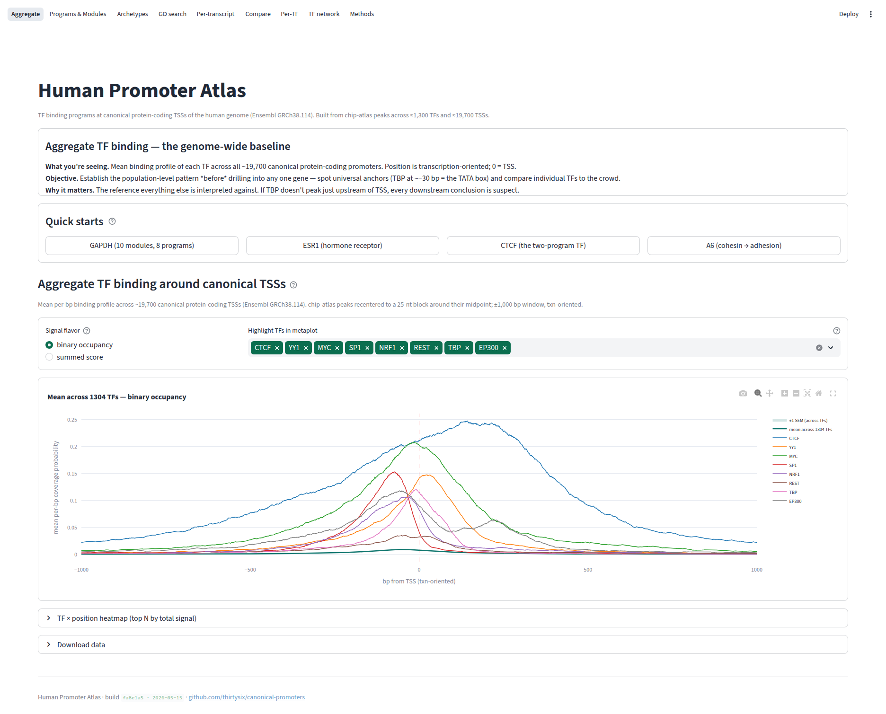
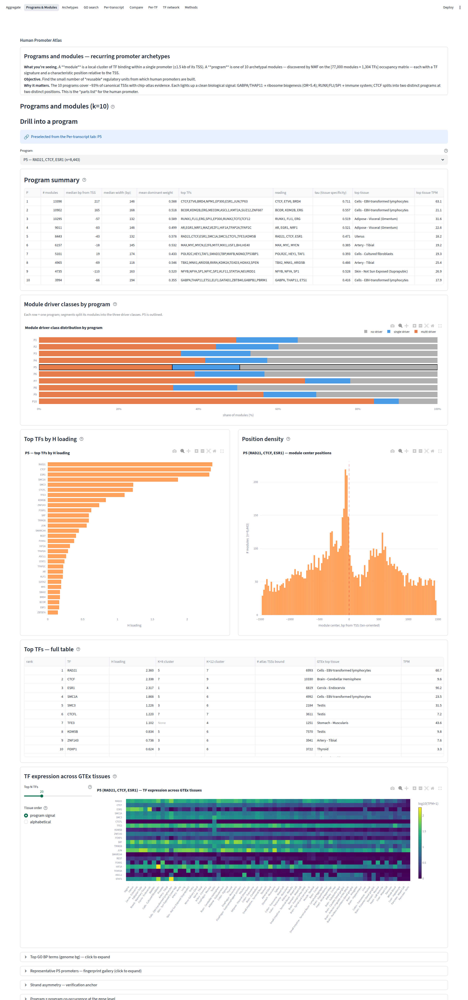
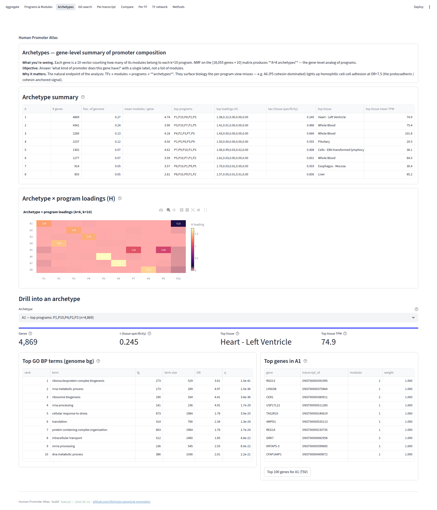
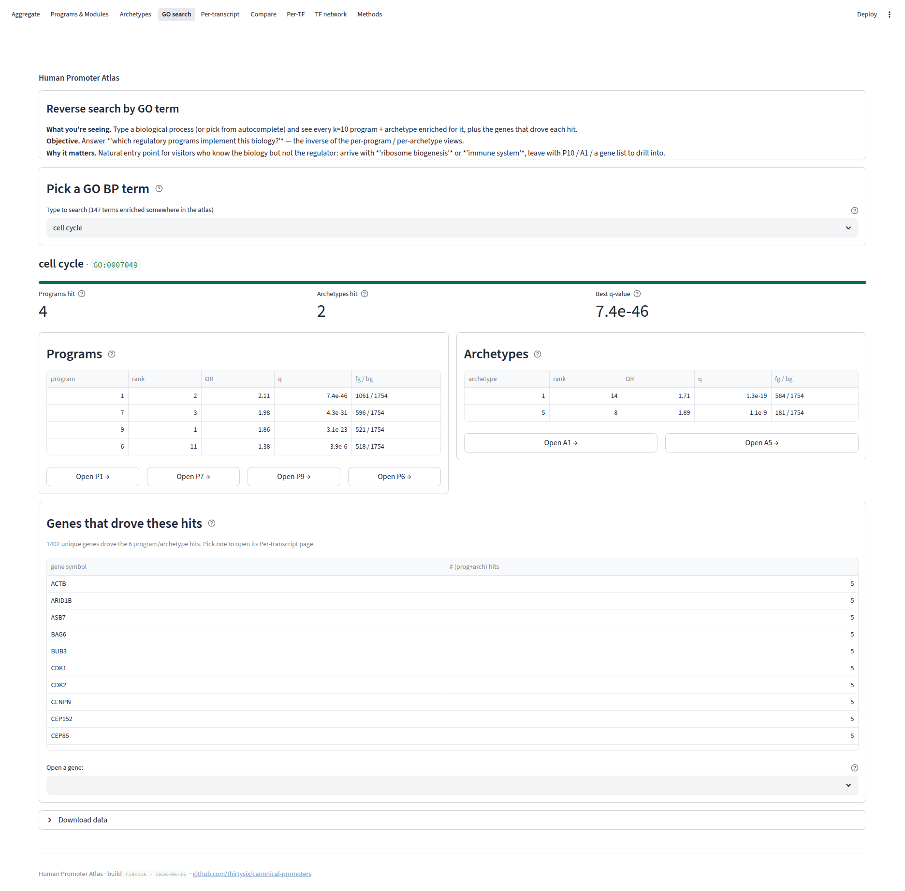
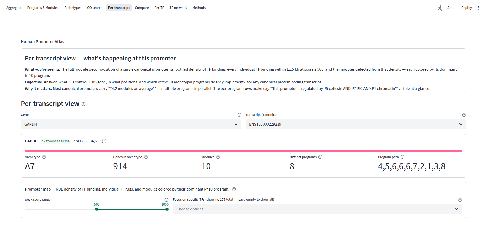
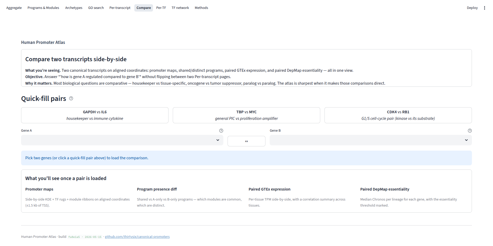
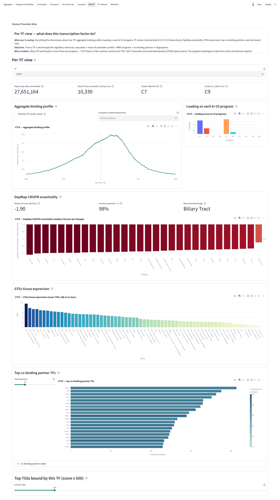
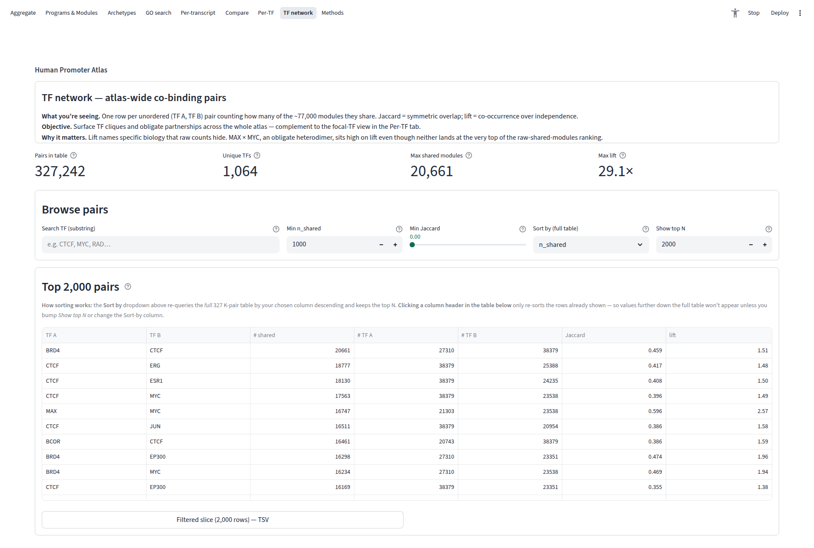
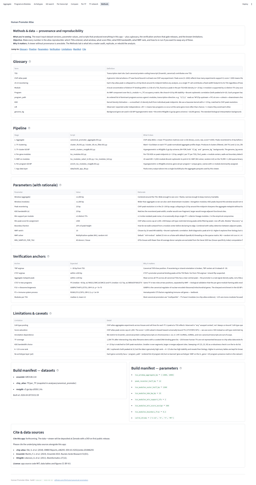

# Human Promoter Atlas

Interactive web companion to a canonical-promoter analysis: TF ChIP-seq
binding patterns at the TSSs of all canonical protein-coding transcripts
in the human genome (Ensembl GRCh38.114), plus the per-gene regulatory
**modules** and NMF **programs** discovered from chip-atlas data over
~1,300 TFs and ~19,700 TSSs.

This repo contains the **viewer**. The upstream analysis pipeline that
produces the inputs lives outside this repo; pointers to its expected
layout are in `data/build_app_db.py`.

## Tour

The viewer has nine top-nav tabs. Each addresses a different scale of
question — population-level, program-level, gene-level, TF-level — over
the same underlying ~12 million peak calls.

URL deep-linking is supported throughout: `?gene=GAPDH&tf=CTCF&program=7`
seeds the search state on load; selectbox changes write back to the URL
so every view is shareable.

### Aggregate — the genome-wide baseline



Mean binding profile of each TF across ~19,700 canonical
protein-coding promoters, transcription-oriented around the TSS at 0 bp.
Establishes the reference everything else is interpreted against — for
example, TBP peaking just upstream of the TSS confirms the canonical
TATA-box position. Highlight individual TFs to compare any one factor to
the crowd; toggle between binary occupancy and summed score.

### Programs & modules — recurring promoter archetypes



A **module** is a local cluster of TF binding within a single
promoter (±1.5 kb of its TSS). A **program** is one of 10 archetypal
modules — discovered by NMF on the ~77,000-module × ~1,300-TF occupancy
matrix — each with a recognizable biological signature (e.g. P5 cohesin,
P7 PIC, P1 chromatin downstream). For each program: top TFs by NMF H
loading, position-density across the window, module-driver-class
breakdown, and a full-atlas TF × tissue expression heatmap from GTEx.

### Archetypes — gene-level promoter labels



The natural endpoint of the hierarchical decomposition:
TFs → modules → programs → **archetypes**. Each canonical gene is a
10-vector counting how many of its modules belong to each program; NMF
on that [genes × programs] matrix gives A = 8 gene-level archetypes.
A6, for example, is the cohesin-dominated archetype whose 4,869 genes
light up homophilic cell-cell adhesion at OR = 7.5 — the
protocadherin/cohesin-anchored signal.

### GO search — reverse lookup by biology



Type a biological process from the GO BP catalogue (or pick from
autocomplete over 147 indexed terms) and see every program + archetype
enriched for it, plus the overlap genes that drove each hit. The
inverse of the per-program GO view: instead of *"what does this program
do?"*, it answers *"which programs implement this biology?"*

### Per-transcript — what's happening at one promoter



The full module decomposition of a single canonical promoter:
smoothed density of TF binding, every individual TF binding within
±1.5 kb at score ≥ 500, and the modules detected from that density —
each colored by its dominant program. Above the promoter map: archetype
label, module count, distinct programs, and the upstream → downstream
program path (e.g. GAPDH is A7 with 10 modules implementing 8 distinct
programs).

### Compare — two transcripts side-by-side



Compare any two genes' promoter architecture on aligned coordinates:
promoter maps, program presence diff (A-only / shared / B-only), paired
GTEx tissue expression, and paired DepMap essentiality. Three curated
pairs are prefilled as quick-starts (GAPDH vs IL6, TBP vs MYC, CDK4 vs
RB1) to illustrate the comparisons the viewer is best at: housekeeper
vs cytokine, general factor vs proliferation amplifier, kinase vs its
substrate.

### Per-TF — what does this transcription factor do?



Everything the atlas knows about a single TF: aggregate binding
profile (with optional cluster-mean overlay), loading on each of the 10
programs, TF-cluster membership at K=8 / K=12, DepMap CRISPR
essentiality across lineages, GTEx tissue expression, top co-binding
partners ranked by shared modules, and top bound TSSs. CTCF — shown
here — appears in both P5 (cohesin near TSS) and P1 (chromatin
downstream): same factor, two roles, separated cleanly by NMF.

### TF network — atlas-wide co-binding pairs



One row per unordered (TF A, TF B) pair, counting how many of the
~77,000 modules they share. 327,242 pairs over 1,064 unique TFs.
Filter by search / minimum n_shared / minimum Jaccard / sort by lift
(co-occurrence over independence). Surfaces TF cliques and obligate
partnerships — MAX × MYC, KAT6A × KAT6B paralogs, CTCF × RAD21
cohesin (87% of RAD21's modules co-bind CTCF), NFYA × SP1, ZFX × ZFY.

### Methods — provenance and reproducibility



Glossary, pipeline summary, parameters with rationale, verification
anchors, limitations, citations. The exact dataset versions, parameter
values, and scripts that produced every number in the rest of the app.

## Stack

- **Streamlit** + **Plotly** — single-language Python app.
- **DuckDB** — single-file analytical database; per-TSS / per-TF
  queries are sub-millisecond after a single `WHERE` index hit.
- **Docker** — single-container deploy behind your reverse proxy of
  choice.

## Repo layout

```
canonical-promoters/
├── README.md                       # this file
├── DEPLOY.md                       # minimal deploy recipe (nginx vhost)
├── Makefile                        # `make db | dev | image | up | logs ...`
├── pyproject.toml                  # python deps
├── data/
│   ├── build_app_db.py             # analyses → duckdb + aggregate parquets
│   ├── build_depmap_*.py           # precompute DepMap pair matrices + corr
│   ├── build_tf_pair_table.py      # atlas-wide TF×TF co-occurrence
│   ├── canonical_promoter.duckdb   # built artifact (gitignored)
│   ├── aggregate/                  # parquet matrices (gitignored)
│   ├── gtex/                       # gtex parquet shards (gitignored)
│   ├── depmap/                     # depmap parquet shards (gitignored)
│   ├── network/                    # tf-pair atlas parquet (gitignored)
│   └── manifest.json               # versions + parameters captured at build
├── app/
│   ├── streamlit_app.py            # entry: nav, query-param seed, footer
│   ├── lib/
│   │   ├── db.py                   # cached DuckDB conn + query helpers
│   │   ├── plotting.py             # plotly figure builders + brand palette
│   │   ├── nav.py                  # tab-to-tab navigation helpers
│   │   └── ui.py                   # shared intro_card helper
│   ├── tabs/                       # one module per top-nav tab
│   ├── requirements.txt
│   └── Dockerfile
├── .streamlit/
│   └── config.toml                 # theme (teal primary)
└── deploy/
    ├── docker-compose.yml          # 127.0.0.1:8501 backend, hardened
    └── nginx-tfbss.conf            # sample nginx vhost
```

## Build the data layer

The viewer reads from a pre-built `data/canonical_promoter.duckdb` plus
several parquet shards. Build them with:

```bash
make db                                       # writes canonical_promoter.duckdb
python data/build_depmap_pair_matrices.py     # slim DepMap matrices
python data/build_depmap_tf_target_correlations.py
python data/build_tf_pair_table.py            # TF × TF co-occurrence
```

The build scripts read raw inputs from two directories whose locations
are configurable via env vars:

| env var              | what it holds                                  | default                |
|----------------------|------------------------------------------------|------------------------|
| `HPA_ANALYSIS_DIR`   | upstream chip-atlas analysis outputs           | `data/raw/analyses`    |
| `HPA_DEPMAP_RAW`     | raw DepMap CSVs (Chronos, expression, Model)   | `data/raw/depmap`      |

## Run locally

```bash
pip install -e .
make db          # one-time (or when upstream analyses change)
make dev         # streamlit on :8501
```

Open http://localhost:8501 .

## Deploy

See `DEPLOY.md` for the minimal nginx + Docker recipe.

## Cite

Forthcoming. The data underlying this viewer will be deposited at Zenodo
with a DOI on first public release.

Source code: MIT. Generated figures + tables: CC-BY 4.0.

Underlying data:
- chip-atlas TF ChIP-seq peaks (https://chip-atlas.org)
- Ensembl GRCh38.114 (https://www.ensembl.org)
- MSigDB c5.go.bp.v2026.1.Hs (https://www.gsea-msigdb.org/gsea/msigdb)
- GTEx v8 (https://gtexportal.org)
- DepMap CRISPR (Chronos) gene effects (https://depmap.org)
